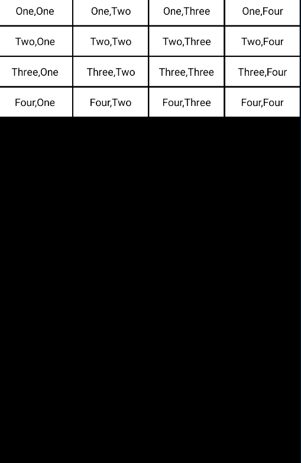
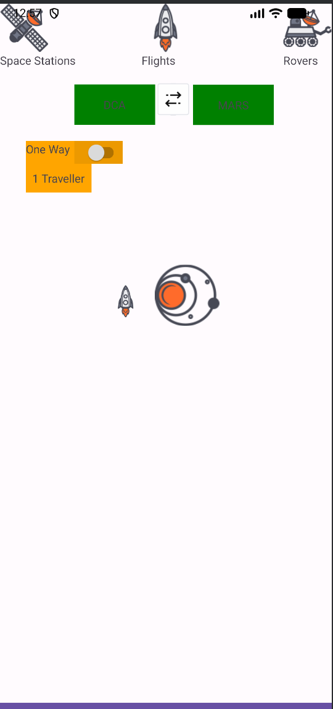
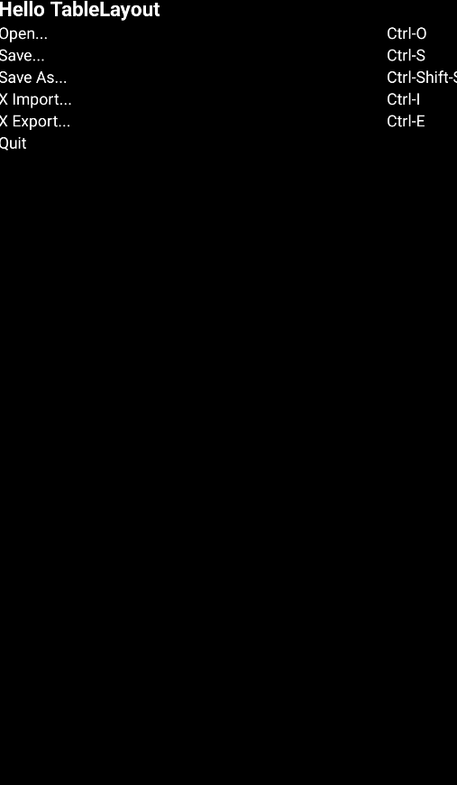

# Android Layout项目实验报告

**课程名称**：移动应用开发  
**实验项目**：Android布局学习与实践  
**学号**：134  
**实验日期**：2025/9/28

---

## 一、实验目的

1. 掌握Android中常用布局的使用方法
2. 学习`LinearLayout`、`ConstraintLayout`、`TableLayout`等布局的特点和应用场景
3. 理解不同布局的嵌套使用和约束关系
4. 熟悉Android界面设计的基本原则

---

## 二、实验环境

| 环境项     | 配置信息             |
|------------|----------------------|
| 开发工具   | Android Studio       |
| 编程语言   | XML                  |
| 构建工具   | Gradle               |
| 目标SDK    | Android API 级别     |

---

## 三、实验内容

### 3.1 LinearLayout布局 ([linearlayout.xml](file://D:\data\android_project\layout\src\main\res\layout\linearlayout.xml))

使用 `LinearLayout` 创建了一个网格布局，具有以下特点：
- 采用垂直方向的外层布局，包含四个水平排列的行
- 每行包含四个等宽的 `TextView` 元素
- 设置了黑色背景和白色文本，形成高对比度显示效果
- 通过 `layout_marginRight` 和整体 `padding` 实现元素间的间距

### 3.2 ConstraintLayout布局 ([constraintlayout.xml](file://D:\data\android_project\layout\src\main\res\layout\constraintlayout.xml))

使用 `ConstraintLayout` 创建了一个简易计算器界面，具有以下特点：
- 通过约束关系精确定位每个控件的位置
- 包含一个结果显示区域和数字按键(0-9)
- 设置了运算符按钮(+、-、×、÷)
- 利用 `layout_constraintHorizontal_weight` 属性实现按钮的均匀分布

### 3.3 TableLayout布局 ([tablelayout.xml](file://D:\data\android_project\layout\src\main\res\layout\tablelayout.xml))

使用 `TableLayout` 创建了一个类似菜单的界面，具有以下特点：
- 采用表格形式组织内容，每行包含标签和快捷键信息
- 使用 `stretchColumns` 属性使第一列自动拉伸填充可用空间
- 设置了黑色背景和白色文本，提高可读性
- 包含标题行和多个功能选项行

### 3.4 复杂ConstraintLayout布局 ([constraintlayout2.xml](file://D:\data\android_project\layout\src\main\res\layout\constraintlayout2.xml))

使用 `ConstraintLayout` 创建了一个太空旅行预订界面，具有以下特点：
- 结合多种控件类型：`ImageView`、`TextView`、`Switch`、`Button`
- 实现了顶部导航栏、出发目的地选择、单程选项开关等功能模块
- 通过复杂的约束关系实现响应式布局
- 使用不同颜色标识不同功能区域（绿色表示地点、橙色表示选项、紫色表示按钮）

---

## 四、运行效果

### 4.1 LinearLayout布局效果


>LinearLayout布局运行效果图

### 4.2 ConstraintLayout布局效果


>ConstraintLayout布局运行效果图

### 4.3 TableLayout布局效果


>TableLayout布局运行效果图

---

## 五、核心代码说明

### 5.1 LinearLayout关键特性 ([linearlayout.xml](file://D:\data\android_project\layout\src\main\res\layout\linearlayout.xml))
```xml
<LinearLayout
    android:layout_width="match_parent"
    android:layout_height="match_parent"
    android:orientation="vertical"
    android:padding="2dp"
    android:background="#000000">
    
    <LinearLayout
        android:layout_width="match_parent"
        android:layout_height="wrap_content"
        android:orientation="horizontal">
        
        <TextView
            android:layout_width="0dp"
            android:layout_height="wrap_content"
            android:layout_weight="1"
            android:background="#FFFFFF"
            android:gravity="center"
            android:padding="10dp"
            android:text="One,One"
            android:textColor="#000000"
            android:layout_marginRight="2dp"/>
        <!-- 其他TextView元素 -->
    </LinearLayout>
    <!-- 其他行 -->
</LinearLayout>
```


### 5.2 ConstraintLayout计算器布局关键特性 ([constraintlayout.xml](file://D:\data\android_project\layout\src\main\res\layout\constraintlayout.xml))
```xml
<androidx.constraintlayout.widget.ConstraintLayout
    android:layout_width="match_parent"
    android:layout_height="match_parent">
    
    <TextView
        android:id="@+id/tvResult"
        android:layout_width="0dp"
        android:layout_height="60dp"
        app:layout_constraintEnd_toEndOf="parent"
        app:layout_constraintStart_toStartOf="parent"
        app:layout_constraintTop_toBottomOf="@id/tvInputHint"/>
        
    <Button
        android:id="@+id/btn7"
        android:layout_width="0dp"
        android:layout_height="60dp"
        app:layout_constraintEnd_toStartOf="@id/btn8"
        app:layout_constraintHorizontal_weight="1"
        app:layout_constraintStart_toStartOf="parent"
        app:layout_constraintTop_toBottomOf="@id/tvResult"/>
    <!-- 其他按钮 -->
</androidx.constraintlayout.widget.ConstraintLayout>
```


### 5.3 TableLayout关键特性 ([tablelayout.xml](file://D:\data\android_project\layout\src\main\res\layout\tablelayout.xml))
```xml
<TableLayout
    android:layout_width="match_parent"
    android:layout_height="match_parent"
    android:stretchColumns="0"
    android:background="#000000">
    
    <TableRow>
        <TextView
            android:layout_width="wrap_content"
            android:layout_height="wrap_content"
            android:text="Hello TableLayout"
            android:textSize="18sp"
            android:textStyle="bold"
            android:textColor="#FFFFFF" />
        <!-- 可选的第二列 -->
    </TableRow>
    <!-- 其他行 -->
</TableLayout>
```


### 5.4 复杂ConstraintLayout太空旅行布局关键特性 ([constraintlayout2.xml](file://D:\data\android_project\layout\src\main\res\layout\constraintlayout2.xml))
```xml
<androidx.constraintlayout.widget.ConstraintLayout
    android:layout_width="match_parent"
    android:layout_height="match_parent">
    
    <!-- 图标和标签组合 -->
    <ImageView
        android:id="@+id/iv_space_station"
        android:layout_width="60dp"
        android:layout_height="60dp"
        app:layout_constraintStart_toStartOf="parent"
        app:layout_constraintTop_toTopOf="parent"
        app:layout_constraintBottom_toTopOf="@id/tv_space_stations"/>
        
    <TextView
        android:id="@+id/tv_space_stations"
        android:layout_width="wrap_content"
        android:layout_height="wrap_content"
        app:layout_constraintStart_toStartOf="@id/iv_space_station"
        app:layout_constraintTop_toBottomOf="@id/iv_space_station"/>
        
    <!-- 出发和目的地选择 -->
    <TextView
        android:id="@+id/tv_dca"
        android:layout_width="100dp"
        android:layout_height="50dp"
        app:layout_constraintStart_toStartOf="parent"
        app:layout_constraintTop_toBottomOf="@+id/tv_space_stations"/>
        
    <!-- 选项和控件 -->
    <TextView
        android:id="@+id/tv_one_way_label"
        android:layout_width="60dp"
        android:layout_height="28dp"
        app:layout_constraintStart_toStartOf="parent"
        app:layout_constraintTop_toBottomOf="@id/tv_dca"/>
        
    <Switch
        android:id="@+id/switch_one_way"
        android:layout_width="60dp"
        android:layout_height="28dp"
        app:layout_constraintStart_toEndOf="@+id/tv_one_way_label"
        app:layout_constraintTop_toTopOf="@+id/tv_one_way_label"/>
        
    <!-- 底部按钮 -->
    <Button
        android:id="@+id/btn_depart"
        android:layout_width="match_parent"
        android:layout_height="50dp"
        app:layout_constraintStart_toStartOf="parent"
        app:layout_constraintEnd_toEndOf="parent"
        app:layout_constraintBottom_toBottomOf="parent"/>
</androidx.constraintlayout.widget.ConstraintLayout>
```


---

## 六、实验总结

通过本次实验，掌握了Android开发中三种主要布局方式的特点和使用场景：
1. `LinearLayout`适合简单线性排列的界面
2. `ConstraintLayout`适合复杂精确定位的界面
3. `TableLayout`适合表格形式的数据展示

这些布局方式各有优势，在实际开发中可根据需求灵活选择和组合使用。