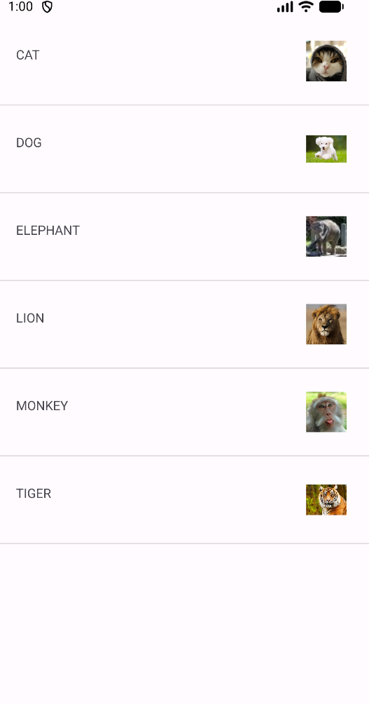
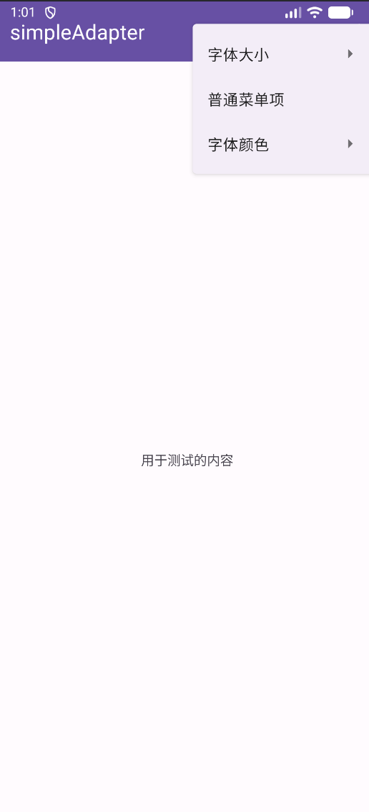
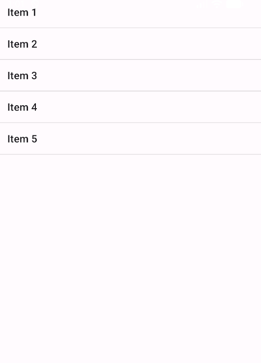

# SimpleAdapter 模块

本项目（`simpleadapter`模块）是一个Android应用开发学习项目，旨在演示和实践Android中多种核心的UI组件和交互模式。项目包含一个主页和四个独立的实验页面，每个页面都专注于一个特定的技术点。

## 功能结构

应用由一个主导航页和四个功能实验页组成。

### 主页 (`HomeActivity`)

- **作用**: 作为应用的启动页面和导航中心。
- **功能**: 包含四个按钮，分别命名为"实验一"、"实验二"、"实验三"和"实验四"，用于跳转到对应的功能页面。

### 实验一 (`MainActivity`)

该实验主要演示Android中列表视图、自定义提示和系统通知的使用。

- **`SimpleAdapter` 与 `ListView`**: 使用`SimpleAdapter`将包含图片和文本的数组数据绑定并显示在一个`ListView`中。
- **自定义 `Toast`**: 当用户点击列表中的某一项时，会弹出一个自定义布局的`Toast`来显示该项的名称。
- **系统通知 (`Notification`)**: 点击列表项后，会发送一个系统通知。点击该通知可以返回到应用页面。

### 实验二 (`DialogActivity`)

该实验主要演示一个基本的UI界面布局。

- **功能**: 展示一个"Android App"的静态注册页面，练习使用`LinearLayout`、`TextView`、`EditText`和`Button`等基本UI控件进行界面布局。

### 实验三 (`Experiment3Activity`)

该实验专注于演示如何在应用顶部操作栏创建和管理选项菜单。

- **XML定义菜单**: 菜单的结构在`res/menu/`目录下的XML文件中进行声明式定义，实现了UI与逻辑的分离。
- **`Toolbar`**: 使用现代的`Toolbar`控件作为应用的操作栏来承载菜单。
- **子菜单和可勾选组**: 通过子菜单和`<group android:checkableBehavior="single">`实现了单选功能，用于动态改变文本的"字体大小"和"字体颜色"。
- **菜单事件处理**: 在`onOptionsItemSelected`方法中捕获用户的菜单点击事件，并执行相应的UI更新逻辑。

### 实验四 (`Experiment4Activity`)

该实验专注于演示列表的上下文操作模式（Contextual Action Mode）。

- **上下文操作模式 (`ActionMode`)**: 通过**长按**列表中的某一项来触发。一旦触发，一个临时的上下文操作栏会取代原有的操作栏。
- **`MultiChoiceModeListener`**: 使用此监听器来管理`ActionMode`的生命周期，包括创建、销毁、响应操作项点击以及监听列表项的选中状态变化。
- **列表多选**: 在上下文操作模式下，用户可以选择多个列表项，操作栏的标题会实时更新已选中的项目数量。

## 运行效果

### 实验一运行效果

>SimpleAdapter与ListView运行效果图

### 实验二运行效果

>Dialog运行效果图

### 实验三运行效果

>OptionsMenu运行效果图

### 实验四运行效果

>ActionMode运行效果图